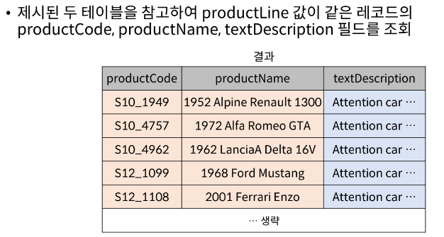
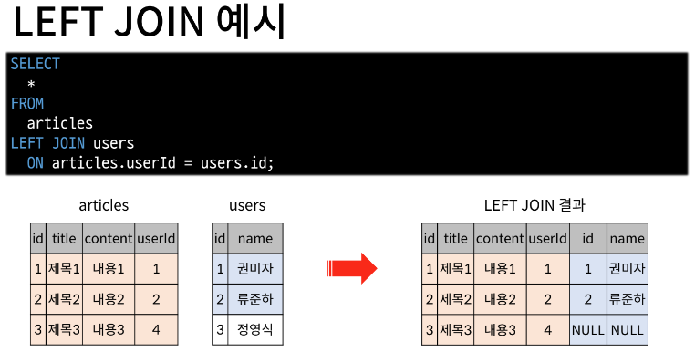
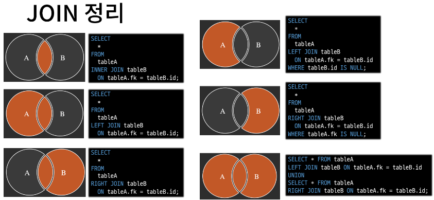

# Joining tables

테이블을 분리하는 것이 데이터 관리에 용이하다.  

그러나 테이블을 분리하면 관리는 용이해질 수 있으나 출력 할 때는 테이블 한 개만을 출력할 수 밖에 없어 '**다른 테이블과 연결지어**' 출력하는 것이 필요  ==> **Joining tables**

### INNER JOIN clause

: 두 테이블에서 값이 일치하는 레코드에 대해서만 결과를 반환

```sql
SELECT
  select_list
FROM
  table1
INNER JOIN table2
  ON table1.fk = table2.pk;
```
- FROM절 이후 메인 테이블(table1) 지정

- INNER JOIN 절 이후 메인 테이블과 조인할 테이블(table2) 지정

- ON 키워드 이후 조인 조건 : table1과 table2 간의 레코드를 일치시키는 규칙 지정

<br>



  ```sql
  SELECT
    productCode, productName, productlines.textDescription
  FROM
    products
  INNER JOIN productlines
    ON products.productLIne = productlines.productLine;
  ```
  - 조회하려는 필드가 두 테이블에 모두 있으면 어떤 테이블의 필드인지 적어줘야 함(SELECT문 참고)

- GROUP BY 적용 예시
  ```SQL
  SELECT
    t1.orderNumber,
      status,
      SUM(quantityOrdered * priceEach) AS totalSales
  FROM
    orders AS t1
  INNER JOIN orderdetails AS t2
    ON t1.orderNumber = t2.orderNumber
  GROUP BY
    orderNumber;
  ```
  - TABLE에도 AS로 별칭을 붙여 간단하게 쓸 수 있음

<br>

---

### LEFT JOIN clause

: 왼쪽 테이블의 모든 레코드 함계 오른쪽 테이블의 일치하는 레코드와 반환

```SQL
SELECT
  select_list
FROM
  table1
LEFT [OUTER] JOIN table2
  ON table1.fk = table.pk;
```



- FROM절 이후 왼쪽 테이블 지정(table1)

- LEFT JOIN절 이후 오른쪽 테이블 지정(table2)

- ON 키워드 이후 조인 조건(fk와 pk)

<br>

- WHERE절을 이용하여 주문내역이 없는 고객 조회
  ```SQL
  SELECT
    contactFirstName,
    orderNumber,
    status
  FROM
    customers AS t1
  LEFT JOIN orders AS t2
    ON t1.customerNumber = t2.customerNumber
  WHERE t2.orderNumber IS NULL;
  ```

- 특징

  - 왼쪽 테이블은 무조건 표시하고 오른쪽 테이블과 매치되는 레코드가 없으면 NULL을 표시
  
  - 왼쪽 테이블 한 개의 레코드에 여러개의 오른쪽 테이블 레코드 일치 시 왼쪽 테이블 레코드 여러 번 표시

<br>

---

### RIGHT JOIN clause

: 왼쪽 테이블의 일치하는 레코드와 함께 오른쪽 테이블의 모든 레코드 반환

```SQL
SELECT
  select_list
FROM
  table1
LEFT [OUTER] JOIN table2
  ON table1.fk = table.pk;
```
- LEFT JOIN과 비교하였을 때 테이블의 위치는 변함 없으며 LEFT JOIN에서 적용되는 것이 반대로 적용

<br>

---
<br>




- UNION
  ```SQL
  SELECT customerNumber, officeCode, t1.city, t2.city
  FROM customers AS t1
  LEFT JOIN offices AS t2 ON t1.city = t2.city

  UNION

  SELECT customerNumber, officeCode, t1.city, t2.city
  FROM customers AS t1
  RIGHT JOIN offices AS t2 ON t1.city = t2.city

  ORDER BY
    customerNumber DESC;
  ```
  - t1과 t2의 합집합으로 모든 레코드 조회

- 테이블 3개 연결
  ```sql
  SELECT
    t1.orderNumber,
    t1.productCode,
    t2.orderDate,
    t3.productName
  FROM orderdetails AS t1
  INNER JOIN orders AS t2 ON t1.orderNumber = t2.orderNumber
  INNER JOIN products AS t3 ON t1.productCode = t3.productCode
  ORDER BY
    orderNumber;
  ```
  - t1을 기준으로 t1의 필드와 같은 것을 fk, pk로 하여 join
  ```sql
  SELECT
    t1.orderNumber,
    t1.productCode,
    t2.orderDate,
    t3.productName
  FROM orderdetails t1
  INNER JOIN orders t2 USING (orderNumber)
  INNER JOIN products t3 USING (productCode)
  ORDER BY
    orderNumber;
  ```
  - FK와 PK는 동일하므로 USING을 사용하여 간단하게 작성 가능, AS 생략 가능